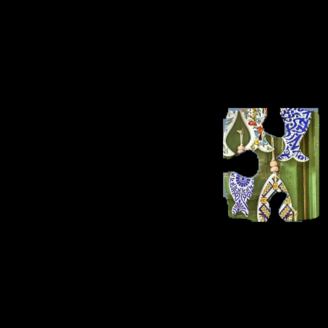

# How Puzzling!

<div align="center">
  
</div>


Automated reconstruction of interlocking jigsaw puzzles using modern vision and reinforcement learning.

This is my MSc capstone project at the University of Colorado Boulder: a culmination of my work in computer vision and machine learning.

While numerous works address the reconstruction of images from geometrically regular fragments (e.g., square, rectangular), few cover interlocking jigsaw puzzles with irregular, convex boundaries. Existing approaches for such puzzles typically depend on heuristics, manual annotations, or shape-only matching without integrating modern foundational models.

"How Puzzling!" demonstrates the feasibility of the automated reconstruction of jigsaw puzzles from images of puzzle pieces on a uniform background. This eliminates the need for human annotation by utilizing model-based segmentation with SAM 3 and YOLOv11, custom edge similarity metrics using DINOv3, and reinforcement-learning guided assembly.


## Experiments

I have listed all experiments in `.md` files across each of the folders of this project.

- [Dataset Creation via Model-Based Segmentation](./dataset/DATASET_CREATION.md)
- [Custom Edge Similarity Metrics](./similarity/SIMILARITY_CALCULATION.md)
- [Reinforcement-Learning Guided Assembly](./rl_env/RL_CREATION.md)

## Setup

Any `.py` file that is not under `utils/` is able to be run, given the terminal instructions at the start of every file.

```bash
# if using venv
python -m venv venv
venv\Scripts\Activate

# if using anaconda
conda create --name puzzling --python=3.13
conda activate puzzling

pip install -r requirements.txt # change pytorch ver for CUDA compatibility
```

- [Jigsaw Puzzle Dataset](https://huggingface.co/datasets/reeeemo/jigsaw_puzzle)
- [Trained Segmentation Model](https://huggingface.co/reeeemo/puzzle-segment-model)
- [Trained PPO Model](https://huggingface.co/reeeemo/ppo-puzzler)