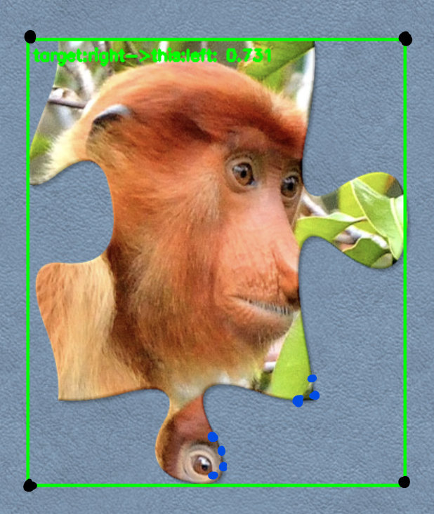

# Similarity Piece-To-Piece

Following the path of the automated reconstruction of jigsaw puzzles that I have laid out, the next step is writing the model that will gather edge similarity metrics. This, paired with understanding how each piece is compared and approximated is crucial to a successful puzzle reconstructor.

I chose to use pairwise cosine similarity to compare each puzzle piece. This was done by feeding each image into a [DINOv3 image encoder](https://huggingface.co/papers/2508.10104). Before I turned to edge-to-edge similarity, I tested 2 other similarity measures to compare.


1. Bounding Box Similarity
    - Little variance, as all puzzle pieces scored above the 0.950 percentile
    - Background and relative colors across the entire puzzle could be a factor for this increase in similarity
2. Segmentation Similarity
    - Better variance (.300 difference)
    - Is not shape-agnostic, which causes similar puzzle pieces which do not fit together to be the most similar.


In all honesty none of these similarities matter if they do not solve the issue of knowing the placement of the piece relative to the selected piece. For example, an internal 4 piece versus another internal 4 piece, which side will fit it best?

**Before I start, some clarification:**
- Unless stated, all code in found in [model.py](../model/model.py)
- I have classified entire puzzle pieces using the `classify_piece()` code
  - For example, a bottom left corner piece would be "corner_bottom_left", or a piece with all 4 sides is "internal".
- Each edge is also classified with its cardinal direction ["top", "bottom", "left", "right"]. **OpenCV uses row-first notation (y-axis-first), and the origin resides in the top left corner** [[3]].
  - Each edge also has a function to define its "type" (`classify_edge_type()`). This is either a "flat" edge, an edge with a "knob" (protruding edge), or a "hole" (depressed edge).
- My segmentation model only produces the needed points to outline a puzzle piece, [here is an example](../dataset/results_images/densify_comparison.png). As a result, approximation becomes more difficult with sparse points on flat edges, therefore `densify_polygons()` was written to walk over each polygon and add another point every step for more precise approximations.
- The centroid calculation, `get_centroid()` was found by calculating image moments of the polygon [[1]] [[2]].


## Edge Similarity

My goal is to compute cosine similarity between each edge of a piece and all opposing edges. To do this, I need a consistent way to assign each point $p_i = (x,y)$ to one of the four cardinal sides (top, bottom, left, right) in image coordinates.

I will represent the four cardinal directions as unit vectors. All directions are defined in image coordinates:

```python
sides = {
    (0, 1), # bottom
    (0, -1), # top
    (-1, 0), # left
    (1, 0), # right
}
```

### Approximations using Math
**My first idea** was to use the local normal of the point(perpendicular to the tangent). [This is the result of my calculations](../dataset/results_images/normal_masks.png). As you can see, the flat edges produce the correct direction while any point in the knob/holes of a jigsaw puzzle piece assigns different directions.

**The second idea** was to use polar coordinates, using the unit vector of the point from the origin, in this case the centroid $c$ of the polygon. I then took each direction unit vector and computed the cosine of the angle between them. [This is the result of my calculations](../dataset/results_images/radial_masks.png). While this image does show accurate approximations, some sides overlap each other, most notably in jigsaw puzzles where the pieces are more irregular, causing later side approximation issues.


### Approximations using Bounding Boxes

These ideas were interesting to explore, as they taught me lots of information about the structure of each polygon (segmentation) in the dataset. However, my final idea and question while working with polar coordinates, was why can't I approximate sides based on their distance to each bounding box side?

To do this, I took the 4 edges of a bounding box:
```python
side_edges = {
  "top_left": (x1, y1),
  "bottom_left": (x1, y2),
  "top_right": (x2, y1),
  "bottom_right": (x2, y2)
}
```
I then computed the Euclidean distance between each edge and each point, then ranked the top 10 by closeness.



*The blue points represent the top points in terms of Euclidean distance, while the black points are each edge of a bounding box*

Some points are closer purely because of a coordinate I do not want to check for (right and left pieces should not be comparing x values). I fix this by reranking each top 10 points by their opposing coordinate value (for example, right and left has their y-axis being compared). This gives the closest point in a convex polygon to the edge point.


Finally, since I know the corners of the polygon, giving each point a side is easier since the points are ordered (top left and top right corner pairs would be considered the top side). The code is found in `get_side_approx()`.


### Piece Classifications

The rules to a puzzle is explored closely in [RL_CREATION.md](../rl_env/RL_CREATION.md), but to summarize: there are rules to a puzzle. For example, a piece with a knob must connect with a hole, and vice versa. To perform this rule checking, pieces and their respective edges should be classified.

Piece classification is done in a relatively simple manner. For each piece, I compare how many flat sides that piece has:

- "Internal" = 0 flat edges
- "Side" = 1 flat edge
- "Corner" = 2 flat edges

However to get these edge classifications (hole, knob and flat), there is some math involved. For a flat edge, I take the 10th and 90th percentile coordinates and compute the deviation between them. If the deviation is above a certain threshold *(I found the optimal to be about 30)*, it is a flat piece.

For knobs and holes, I compute the distance from the polygon centroid and the 10th percentile point, and the distance between the centroid and the middlemost value of the side. If the distance between the 10th percentile is larger than the distance from the middlemost value (which from my research given a dense polygon is guaranteed to remain in the domain of the depressed or protruding edge), it is a hole. Otherwise it is a knob.


**Finally, after all edges are computed, I compute cosine similarity using each cropped edge of every puzzle piece. This can be visualized by running `similarity.py` according to the instructions listed at the beginning of the file.**

## References (TODO: cite these)

1. Huamán, A. (n.d.). Goal. OpenCV. <https://docs.opencv.org/4.x/d0/d49/tutorial_moments.html>
2. Dayala, R. (2020, July 21). 10.4 Hu Moments. Computer Vision. <https://cvexplained.wordpress.com/2020/07/21/10-4-hu-moments/>
3. user3747190. (2014, September 3). OpenCV Point(x,y) represent (column,row) or (row,column). Stack Overflow. <https://stackoverflow.com/questions/25642532/opencv-pointx-y-represent-column-row-or-row-column>
‌

[1]: https://docs.opencv.org/4.x/d0/d49/tutorial_moments.html
[2]: https://cvexplained.wordpress.com/2020/07/21/10-4-hu-moments/
[3]: https://stackoverflow.com/questions/25642532/opencv-pointx-y-represent-column-row-or-row-column